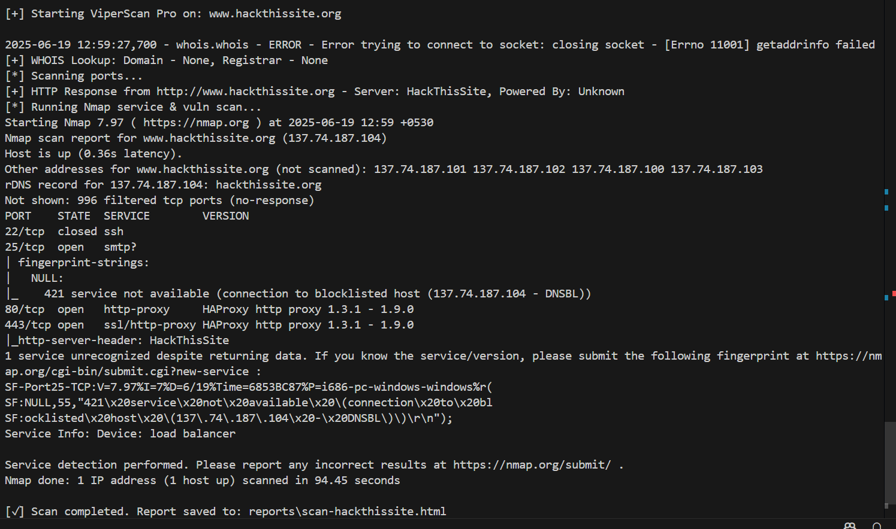
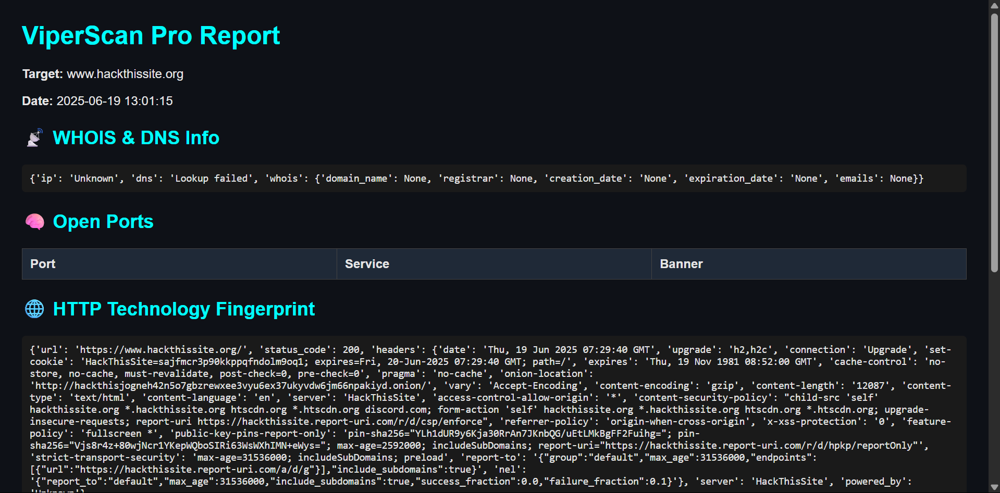
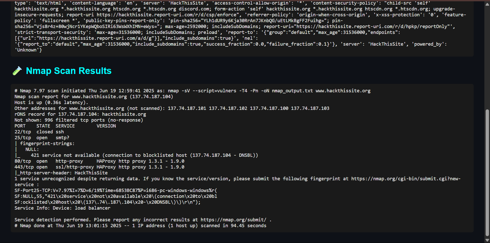

# ViperScan Pro

**ViperScan Pro** is an advanced Python-based network and web scanner built for reconnaissance, vulnerability detection, and report generation. It's designed for cybersecurity professionals, CTF players, and learners.

## Features

-  Fast multi-threaded port scanning
-  HTTP header and technology detection
-  WHOIS & DNS info collection
-  CVE-ready (via optional Nmap integration)
-  HTML report generation
-  Clean modular Python code
-  Rich CLI interface


## Requirements

Install dependencies:
``` bash
pip install -r requirements.txt
```

Tools (optional but recommended):
- nmap (for advanced scan mode)
- whois (already handled by Python lib)

## Project Structure

viperscan_pro/
├── viperscan.py             
├── modules/
│   ├── port_scanner.py
│   ├── http_fingerprint.py
│   ├── whois_lookup.py
│   └── report_generator.py
├── reports/
│   └── scan-<target>.html
└── requirements.txt

## Usage

python viperscan.py -t example.com --full --output report.html

Flags:

  -t, --target → Target domain/IP
  --full → Run all modules

-o, --output → Save report to specific file

## Sample Output




## License
MIT License. Educational use only. Respect legal boundaries!

## Author
Asjath Ahamed — Connect on LinkedIn
